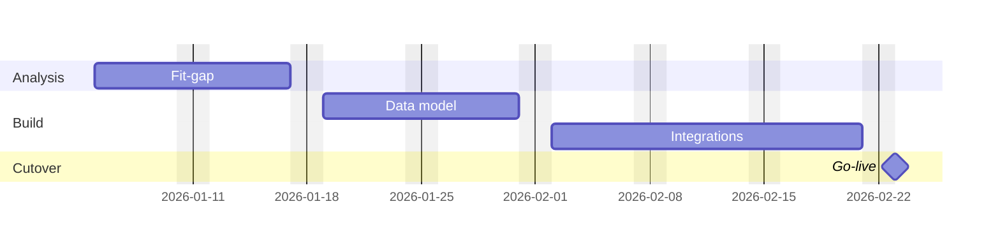

# gantt

Use for project and migration plans where durations and dependencies matter.

```mermaid
gantt
  accTitle: Migration plan
  accDescr: Analysis, build and cutover phases with build depending on analysis.
  dateFormat YYYY-MM-DD
  excludes weekends
  section Analysis
    Fit-gap        :a1, 2026-01-05, 10d
  section Build
    Data model     :b1, after a1, 10d
    Integrations   :b2, after b1, 15d
  section Cutover
    Go-live        :milestone, m1, after b2, 0d
```

- Task IDs without spaces; `after id`; `crit`, `active`, `done`, `milestone` tags.
