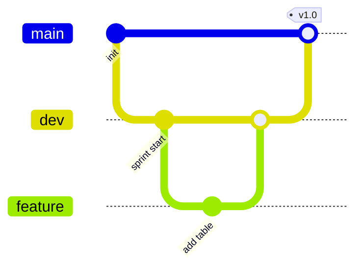

# gitGraph

Use for branching strategies and ALM promotion.

```mermaid
gitGraph
  accTitle: Feature branch flow
  accDescr: A feature branch is merged into dev, then dev is merged into main for release.
  commit id: "init"
  branch dev
  checkout dev
  commit id: "sprint start"
  branch feature
  checkout feature
  commit id: "add table"
  checkout dev
  merge feature
  checkout main
  merge dev tag: "v1.0"
```

- Commit IDs quoted; `branch`, `checkout`, `merge`, `cherry-pick id: "x"`; `tag:` on commits and merges.
