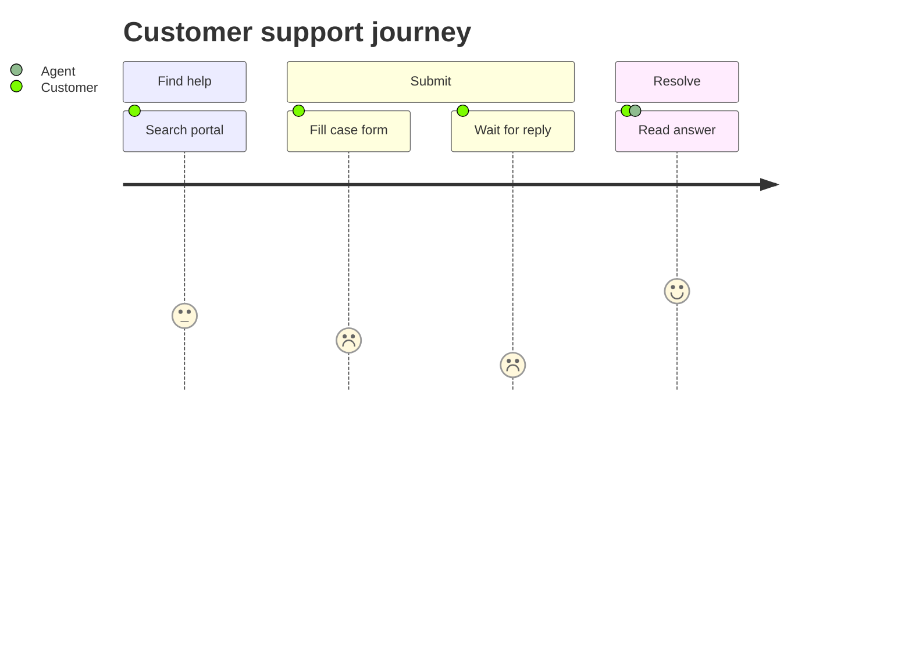

# journey

Use for a user's experience across steps with a 1–5 sentiment score.

```mermaid
journey
  accTitle: Case submission journey
  accDescr: A customer finds help, submits a case and gets an answer; waiting scores lowest.
  title Customer support journey
  section Find help
    Search portal: 3: Customer
  section Submit
    Fill case form: 2: Customer
    Wait for reply: 1: Customer
  section Resolve
    Read answer: 4: Customer, Agent
```

- `Task: score: actor[, actor]`; score 1 (bad) to 5 (good).
