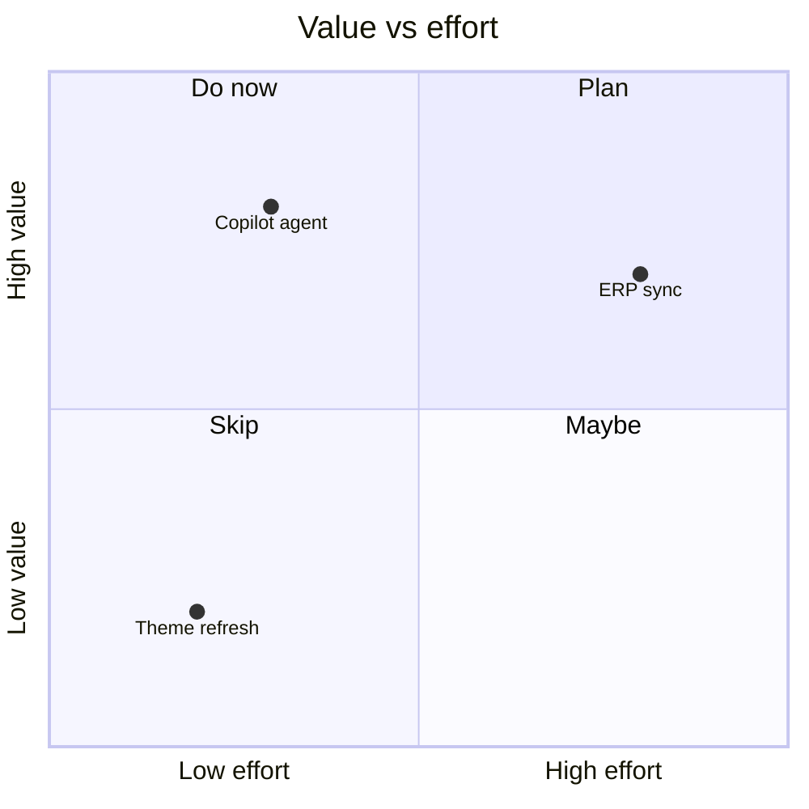

# quadrantChart

Use for prioritisation (value vs effort, risk vs impact). Coordinates 0–1.

```mermaid
quadrantChart
  accTitle: Backlog prioritisation
  accDescr: Items plotted by effort and value; the agent is high value, low effort.
  title Value vs effort
  x-axis Low effort --> High effort
  y-axis Low value --> High value
  quadrant-1 Plan
  quadrant-2 Do now
  quadrant-3 Skip
  quadrant-4 Maybe
  Copilot agent: [0.3, 0.8]
  ERP sync: [0.8, 0.7]
  Theme refresh: [0.2, 0.2]
```

- Quadrants numbered 1 top-right, 2 top-left, 3 bottom-left, 4 bottom-right.
